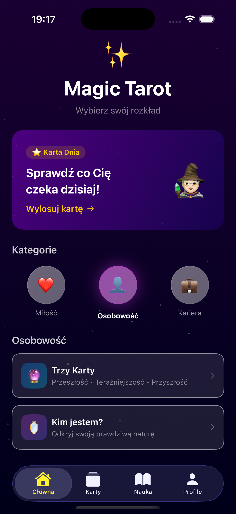
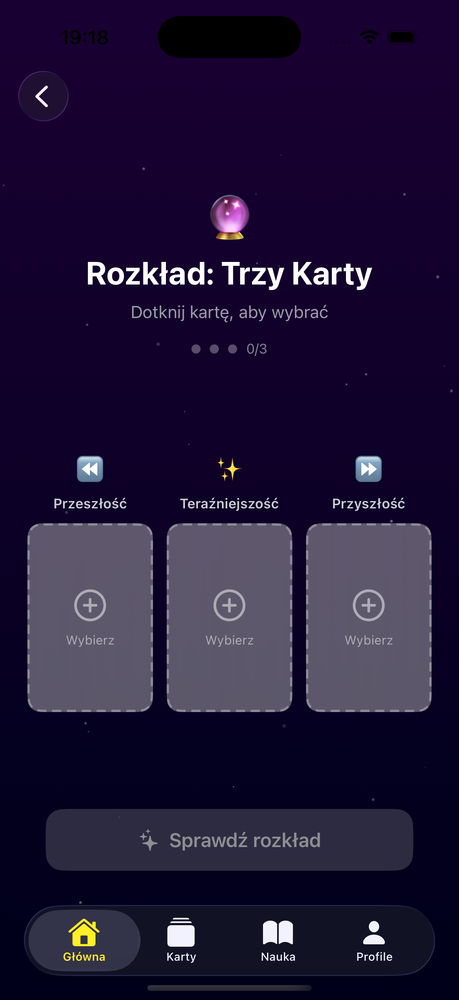
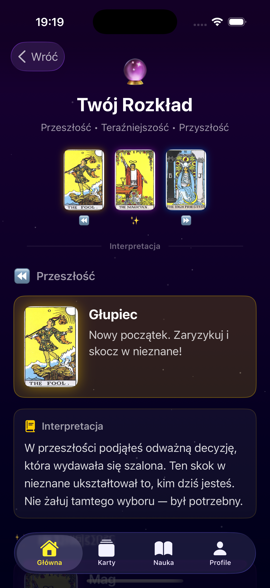
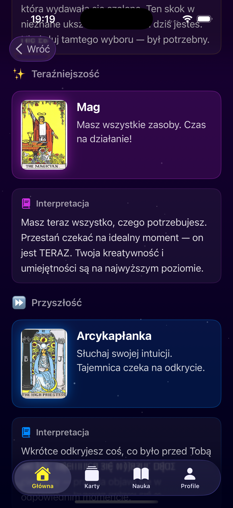
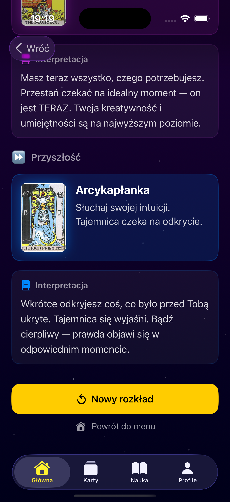

<div align="center">

# 🔮 Magic Tarot

**Mystical tarot reading app built entirely in SwiftUI**

<br />


<br /><br />


<br />

*☝️ Живая демонстрация приложения*

</div>

---

## 📸 Screenshots

<div align="center">

| Home | Spread | Card Selection | Interpretation | Result |
|:-------:|:-------:|:-----------:|:-------------:|:---------:|
|  |  |  |  |  |

</div>

---

## ✨ Features

| Feature | Description |
|---------|-------------|
| 🃏 **Card of the Day** | Daily tarot card with mystic banner |
| 🔮 **Three-Card Spread** | Past · Present · Future reading |
| 📜 **Interpretations** | Detailed meanings with typewriter animation |
| 🌟 **Star Background** | Animated particle effects |
| 📳 **Haptic Feedback** | Vibration on every interaction |
| 💎 **Luxury UI** | Glass morphism + gradient categories |
| 🏗 **Clean Architecture** | MVVM with `@Observable` |
| 📦 **Zero Dependencies** | No third-party libraries |

---

## 🚀 Roadmap

- [x] Card of the Day
- [x] Three-Card Spread
- [x] Card interpretations with typewriter effect
- [x] MVVM Architecture
- [x] TabBar navigation
- [ ] Save reading history (SwiftData)
- [ ] More spread types (Celtic Cross, Love)
- [ ] AI interpretations (OpenAI)
- [ ] App Store release
- [ ] Premium subscription (StoreKit 2)

---

## ⚙️ Run Locally

```bash
git clone https://github.com/AvetisDav/MagicTarot.git
