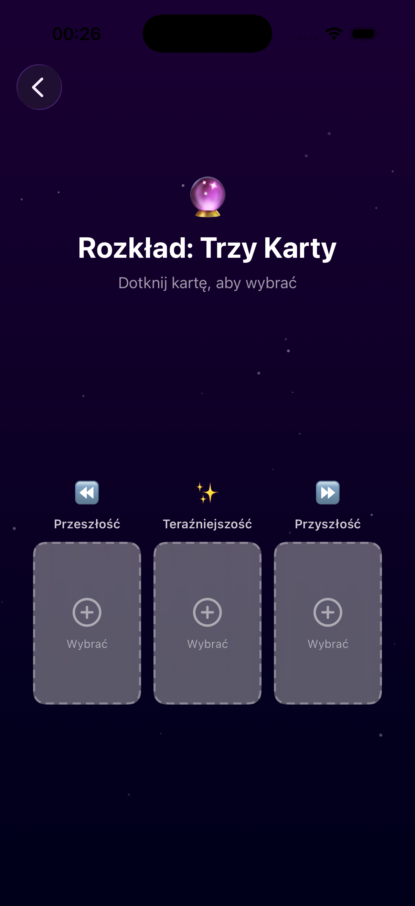
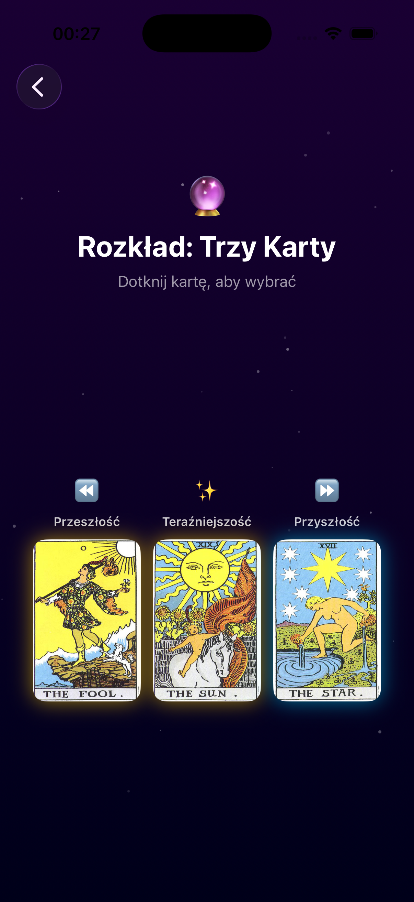
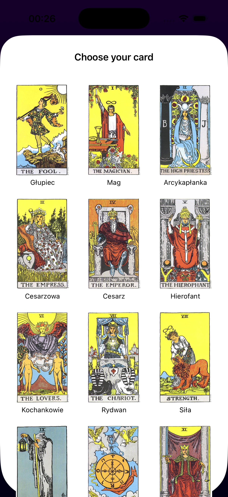

# 🔮 Magic Tarot App

  
  
  

 

**Magic Tarot** is a mystical iOS application built with **SwiftUI** designed to bring digital tarot readings to life.  
The app combines traditional card meanings with modern animations and clean architecture.

> *"The cards don't predict the future, they help you create it."*

---

## 📱 Features (Implemented)

### ✅ Core Functionality
- **Card of the Day:** Pull a random card with a 3D flip animation.
- **Three-Card Spread:** A dedicated layout for "Past / Present / Future" readings.
- **Smart Data Model:** Custom `TarotCard` struct with images, descriptions, and color coding.

### 🎨 UI/UX
- **Modern Home Screen:** Clean navigation using `NavigationStack`.
- **Animations:** Custom `rotation3DEffect` for realistic card flipping.
- **Adaptive Layout:** Uses `ZStack`, `VStack`, and `Grid` layouts for responsive design.
- **Loading States:** Simulated "AI Thinking" process with loading indicators.

### 🛠 Technical Highlights
- **SwiftUI Lifecycle:** Pure SwiftUI app structure (`App` protocol).
- **Clean Code:** Reusable components (e.g., `CardPlaceholder` View).
- **Navigation:** Deep linking and sheet presentation logic.

---

## 📸 Screenshots
*(Coming soon... You can add screenshots of your simulator here later!)*

| Home Screen | Card Flip | Spread Layout |
|:---:|:---:|:---:|
  

---

## 🚀 Roadmap (Next Steps)
- [ ] Connect OpenAI API for personalized interpretations.
- [ ] Add full deck of 78 cards.
- [ ] Implement "Save Reading" feature using SwiftData / CoreData.
- [ ] Add Haptic Feedback (vibrations) for better immersion.

---

## 👨‍💻 Author

**Avetis Davydov**  
Aspiring iOS Developer based in Warsaw 🇵🇱  
[LinkedIn](https://www.linkedin.com/in/avetis-davydov-0288253aa/) • [Portfolio](Soon)

---
*Created as part of my journey from Hospitality to Tech.* 🚀

